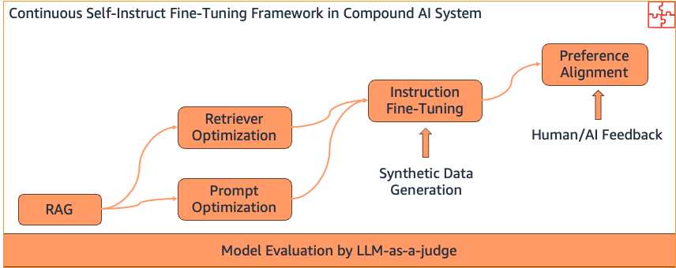
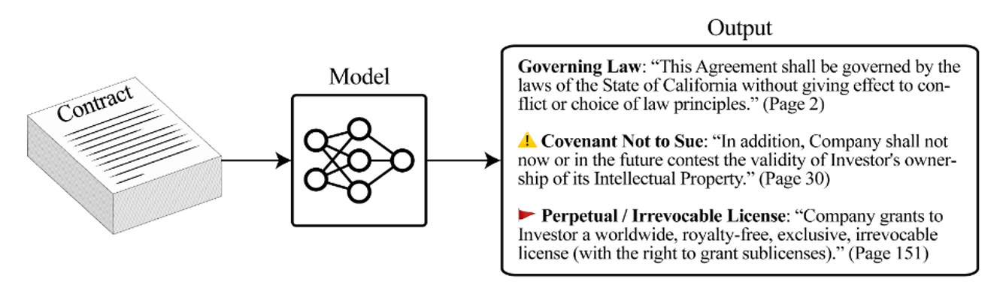
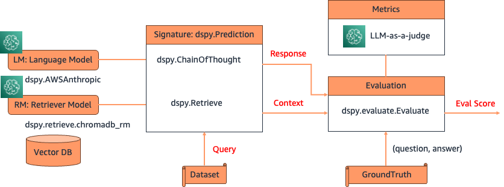
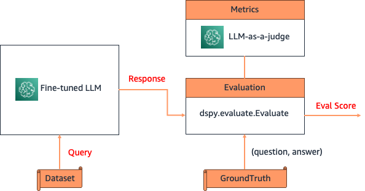
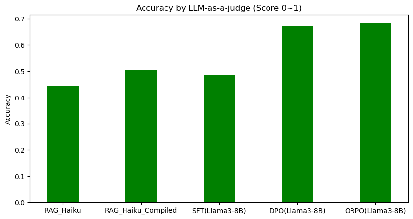

# Improve LLM performance by continuous fine-tuning with Compound AI system

Fine-tuning a pre-trained LLM allows users to customize the model to perform better on domain specific tasks or align more closely with human preferences. It is a continuous process to keep the fine-tuned model accurate and effective in changing environments, to adapt to the data distribution shift (concept shift) and prevent performance degradation over time. Continuous fine-tuning also enables models to integrate human feedback, address errors and tailor to real-world applications. Users can use Supervised Fine Tuning (SFT) and Instruction Tuning to train the LLM to perform better on specific tasks using human annotated datasets and instructions. When we have user feedback to the model responses, we can also use Reinforcement Learning with Human Feedback (RLHF) to guide the LLM’s response by rewarding the outputs that align with human preferences. There are various techniques of preference alignment, including Proximal Policy Optimization (PPO), Direct Preference Optimization (DPO), Odds Ratio Policy Optimization (ORPO) and other algorithms. 

Precise and responsible outputs from fine-tuned LLM require big efforts from subject matter experts (SMEs). The manual annotation of extensive training data for fine-tuning by human SMEs and collecting user feedback to align LLM responses with human preferences are both resource-heavy and time-intensive. Also, the continuous fine-tuning process requires orchestrating the multiple steps of data generation, LLM training, feedback collection and preference alignments with scalability, resiliency and resource efficiency. 

To address these challenges, we present an innovative Continuous Self-Instruct Fine-Tuning framework that streamlines the LLM fine-tuning process of training data generation and annotation, model training and evaluation, human feedback collection and alignment with human preference. This framework is designed in a Compound AI system to drive the fine-tuning workflow for performance improvement, versatility and re-usability. We use DSPy (Declarative Self-improving Language Programs) to demonstrate the framework in Compound AI system using a question-answer task including RAG (Retrieval Augmented Generation) optimization, LLM fine-tuning and evaluation, and human preference alignment for performance improvement. 

### A Question-Answer task with RAG and LLM fine-tuning by DSPy

Dataset: We use Contract Understanding Atticus Dataset (CUAD) for a question-answer task. CUAD is the dataset for legal contract review, created with dozens of legal experts from The Atticus Project and consists of over 13,000 annotations.

Notebook 1: [Prepare for dataset from CUAD document using LLM based synthetic data generation](notebook/synthetic_test_data_generation.ipynb)      

#### Question-Answer by RAG pipeline in DSPy

Notebook 2: [RAG pipeline and compiled prompt automation by DSPy](notebook/dspy_rag.ipynb)      
Notebook 3: [RAG pipeline and compiled prompt automation - batch inference](notebook/dspy_rag_compile.ipynb) 

#### Fine-tuned LLM and evaluation in DSPy

Notebook 4: [Fine-tuned LLM evaluation by DSPy](notebook/dspy_rag_ft.ipynb) 

## Contribute
If you would like to contribute to the project, see [CONTRIBUTING](CONTRIBUTING.md) for more information.

## License
The code examples in this library are released under the MIT-0 License. See the [LICENSE](LICENSE-NOTEBOOKS) file for details.
